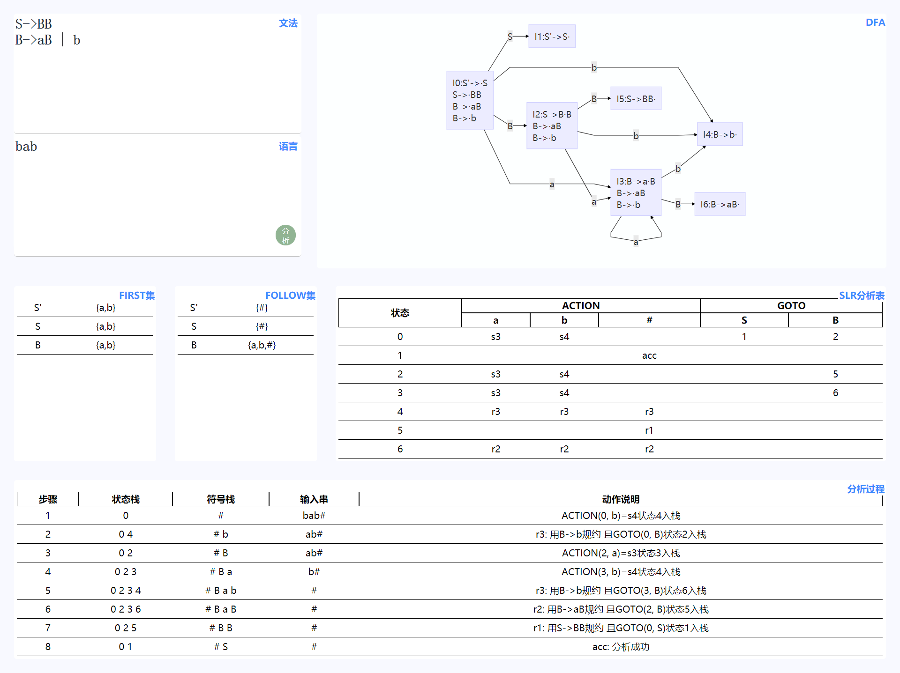
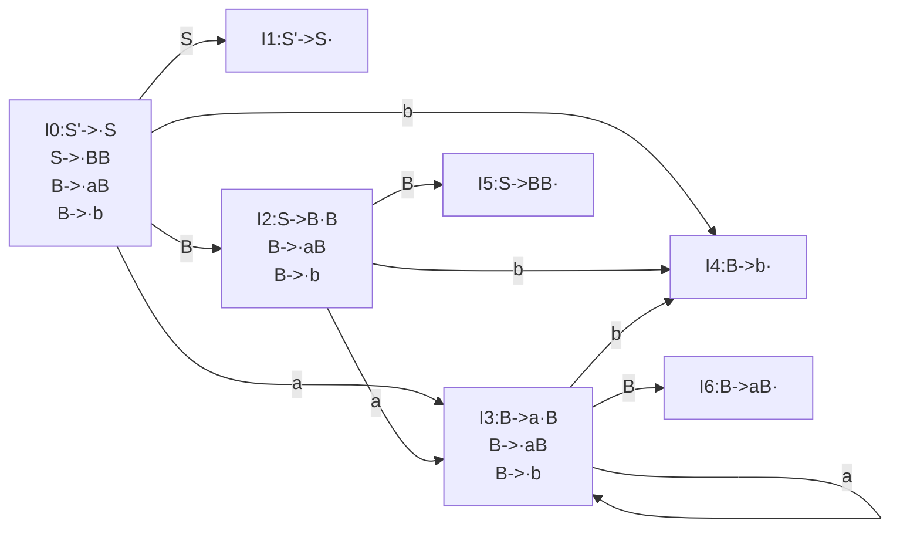

# 语法分析器


## 简介

本程序实现了一个SLR(1)分析器

根据输入的文法和语言，自动生成DFA， FIRST集，FOLLOW集，SLR(1)分析表，最后根据SLR分析表生成语言的分析过程.


## 截图




## 基本原理

### 存储形式

首先把形式为`S->AB`的形式转换成计算机的数据结构来储存，我选用Map映射的形式来存储,如下

`{'key':'S', 'value': 'AB'}`

### 项目存储形式

之后生成的项目集用`{'key':'S', 'value': 'AB', 'dot': 0}`的形式存储， dot代表了`·`的位置。这样的结构方便查找点的位置`item['value'][item['dot']]`即为跟在`·`后面的终结符或者非终结符。

### 项目集规范族

项目集规范族是一个二维数组， `itemfamily[0]`即代表I0中所包含的所有项目。


### GoMap函数

为了生成DFA，我用GoMap函数记录了项目集规范族之间的关系。`GoMap[0][1]=S`即代表从I0到I1经过了S非终结符.


### DFA

DFA的生成利用了第三方js库mermaidjs， 基本语法如下



### FIRST集和FOLLOW集的生成

FIRST集合FOLLOW集的生成用了较多的循环，这里怀疑是数据结构设计的问题，虽然最终结果是正确的，但是过多的嵌套循环让代码不容易被看懂，这边是需要优化的。

### ACTION和GOTO表

ACTION和GOTO是最终需要生成的结果， 结构如下

- ACTION

```json
[
    {"a":"s3","b":"s4"},
    {"#":"acc"},
    {"a":"s3","b":"s4"},
    {"a":"s3","b":"s4"},
    {"a":"r3","b":"r3","#":"r3"},
    {"#":"r1"},
    {"a":"r2","b":"r2","#":"r2"}
]
```

- GOTO

```json
[
    {"S":"1","B":"2"},
    {},
    {"B":"5"},
    {"B":"6"},
    {},
    {},
    {}
]
```


数组下标与项目集规范族对应.