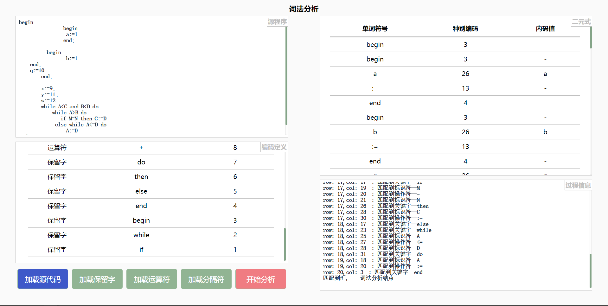

# 词法分析器

## 入口

index.html


## 实验要求

设计一个词法分析器，对下列程序进行词法分析，输出单词的种别编码和值。

`#~`作为程序的结束

```
begin
	begin
		begin 
		 a:=1
 		end;
 		
 	  begin 
		 b:=1
    end;
    q:=10
	end;
	x:=9;
	y:=11;
	z:=12
end
#~
```


## 使用方法

先加载**源文件**,**保留字**,**运算符**,**分隔符**, 示例文件在config文件夹下


## 介绍

本网页可视化显示词法分析的过程,使用文件配置，可动态加载不同的源代码和保留字，运算法等配置。

- 左上角显示加载好的源程序(可再次修改), 
- 左下角是保留字等的种别编码定义
- 右上角是通过源代码和配置文件分析出的单词符号及其二元式(种别编码，二元式)
- 右下角显示词法分析的过程，错误的时候也能显示错误的位置行号和错误提示;


## 演示




地址: [compiler.acring.me.](http://compiler.acring.me.)